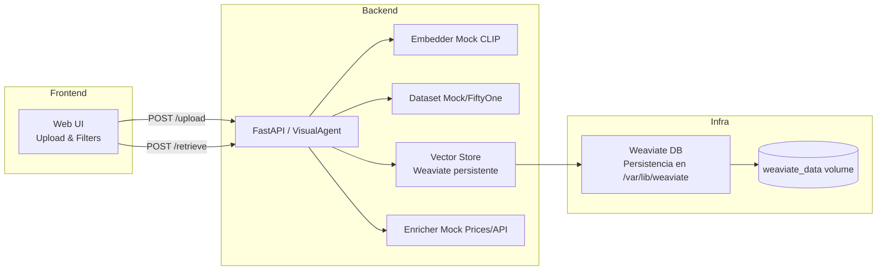
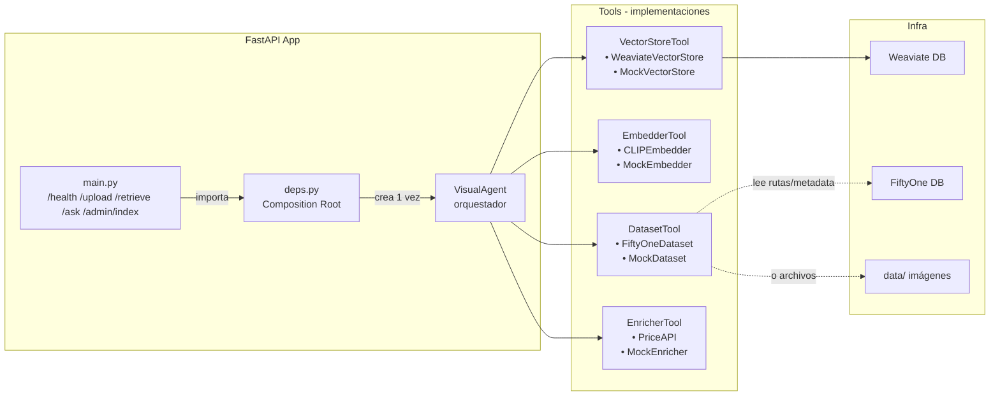
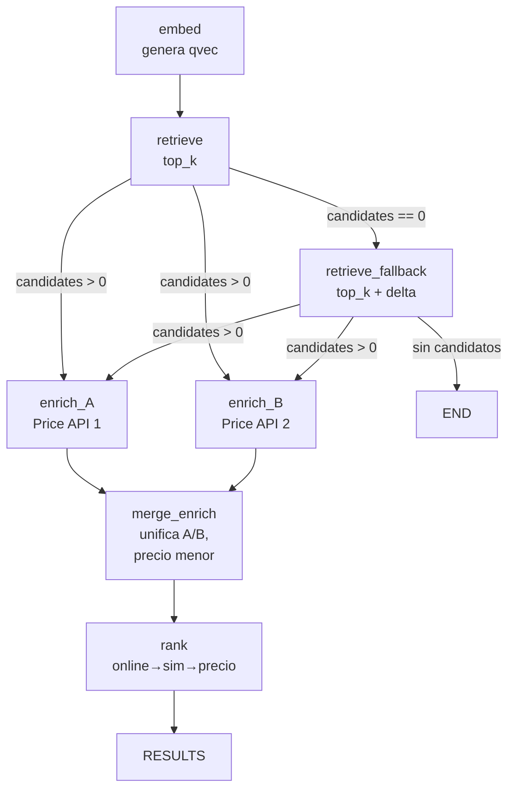

# Visual RAG Agents

**Visual RAG Agents** es un sistema demostrativo de **búsqueda y recomendación de prendas por similitud visual**, con:

- **Frontend minimal** (HTML/JS/CSS) para subir una imagen y obtener resultados en grilla.  
- ⚡ **FastAPI backend** con endpoints `/upload`, `/retrieve` y `/ask`.  
- 🗂️ **Vector Store persistente** usando **Weaviate** en Docker.  
- 🧩 **Arquitectura modular**: cada tool (embedder, dataset, vector store, enricher) puede reemplazarse fácilmente.  
- 🤖 **Opcional**: integración con **LangChain Agent** (para queries en lenguaje natural) y **LangGraph** (para orquestación avanzada con ramas, reintentos y paralelo).

---

## ✨ Demo en 1 minuto


1. Subes una imagen (camisa, blazer, etc.).  
2. El sistema genera embeddings (mock CLIP en esta demo).  
3. Consulta Weaviate para encontrar los más similares.  
4. Enriquece con metadata (marca, color, fuente, precio).  
5. Muestra en el frontend los **Top-K** resultados con filtros de color y precio.

---

## 📦 Arquitectura




---

## 🛠️ Stack Tecnológico

- **Backend:** FastAPI (Python 3.11)  
- **Frontend:** HTML + JS + CSS (sin frameworks)  
- **Vector DB:** Weaviate (con persistencia en Docker Volume)  
- **Orquestador determinista:** `VisualAgent`  
- **Opcional:**  
  - LangChain Agent → interacción en lenguaje natural.  
  - LangGraph → grafo de nodos con ramas, reintentos, paralelo.  

---

## 🚀 Cómo correr

### 1. Clonar repo
```bash
git clone https://github.com/tu-org/visual-rag-agents.git
cd visual-rag-agents
```

### 2. Configurar entorno

En `.env` puedes añadir tu `OPENAI_API_KEY` si quieres probar `/ask`.

### 3. Levantar con Docker Compose
```bash
docker compose up -d --build
```

Servicios:
- **Weaviate** → http://localhost:8080  
- **FastAPI** → http://localhost:8000  
- **Frontend** → http://localhost:8000/  

### 4. Probar endpoints
- Frontend: [http://localhost:8000/](http://localhost:8000/)  
- API docs: [http://localhost:8000/docs](http://localhost:8000/docs)  
- Healthchecks:  
  ```bash
  curl http://localhost:8000/health
  curl http://localhost:8080/v1/.well-known/ready
  ```

---

## 🔑 Endpoints principales

### `POST /upload`
Sube una imagen y devuelve la ruta local en el servidor.

```bash
curl -F "file=@query.jpg" http://localhost:8000/upload
```

### `POST /retrieve`
Busca imágenes similares, con filtros opcionales.

```bash
curl -X POST http://localhost:8000/retrieve   -H "Content-Type: application/json"   -d '{
    "query_image": "data/uploads/abc123.jpg",
    "top_k": 8,
    "prefer_online": true,
    "filter_color": "grey",
    "max_price": 50
  }'
```

### `POST /ask` (opcional)
Interfaz conversacional (requiere instalar `requirements-agent.txt`).

```bash
curl -X POST http://localhost:8000/ask   -H "Content-Type: application/json"   -d '{"prompt": "Busca similares a data/query.jpg, online y debajo de 40€"}'
```
##  Estructura de Singletons 
---



## 🗂️ Persistencia en Weaviate

Los datos (schema, objetos, vectores) se guardan en el volumen:
```yaml
volumes:
  weaviate_data:
```

👉 Persiste aunque pares y levantes el stack.  
👉 Si quieres verlos en tu carpeta local, cambia a:
```yaml
volumes:
  - ./weaviate_data:/var/lib/weaviate
```

---

## 🧩 Opciones avanzadas

### 🔹 LangChain Agent
Envuelve `VisualAgent` como `StructuredTool` para consultas en lenguaje natural.  
Ejemplo de prompt:
> *“Encuentra similares a data/query.jpg, color negro, máximo 40 EUR, online primero.”*

### 🔹 LangGraph
Orquesta el pipeline como grafo:
- Rama: si no hay candidatos → `retrieve_fallback`.  
- Paralelo: enriquecer desde `PriceAPI1` y `PriceAPI2`.  
- Merge → rank → resultados.  
- Reintentos, métricas y checkpoints incluidos.

### 🧭 Flujo con LangGraph (ramas + paralelo)



---

## 📂 Estructura de proyecto

```
app/
├── main.py             # FastAPI (endpoints /upload, /retrieve, /ask)
├── deps.py             # Singletons de VisualAgent
├── models.py           # Pydantic I/O
├── core/
│   ├── orchestrator.py # VisualAgent determinista
│   ├── types.py        # DTOs
│   └── tools/          # Tools mock (embedder, dataset, vstore, enricher)
├── agent_runtime.py    # (opcional) LangChain agent wrapper
├── graph_runtime.py    # (opcional) LangGraph pipeline
└── static/             # Frontend (index.html, styles.css, script.js)
```

## Comandos para ejecución de la indexación (One Shot)
1. Indexar
```
docker compose run --rm indexer
```
2.Reindexar desde cero
```
curl -s -X DELETE http://localhost:8080/v1/schema/FashionItem

```

### usando el valor por defecto del FILE
```
make upload-retrieve
```
### o especificando tu imagen
```
make upload-retrieve FILE=./data/uploads/mifoto.jpg TOP_K=6
```


---

## Cómo extender

1. Sustituir `MockEmbedder` por **CLIP/OpenCLIP** o por una implementación propia.  
2. Cambiar `MockDataset` por **FiftyOne** (dataset real de prendas).  
3. Cambiar `MockVectorStore` por **Weaviate** (ya montado) o FAISS.  Puede aportarse una implementación de otro cliente de Vector Store.
4. Cambiar `MockEnricher` por API real de precios/stores.  Se puede igualmente extender por otra implementación de Enricher. La idea es agregar los datos específicos para cada uso de negocio.

👉 Gracias a las **interfaces comunes** (`EmbedderTool`, `DatasetTool`, `VectorStoreTool`, `EnricherTool`), no se requiere reescribir el orquestador. Sin embargo, puede jugarse a adaptar y agregar nuevos tools que el agente pueda requerir.

---

## 📊 Métricas y Observabilidad

- Cada nodo mide tiempo y resultados → logs estructurados.  
- Con LangGraph puedes obtener métricas por estado (`meta`).  
- Fácil de integrar con Prometheus/Grafana si lo deseas.

---

## 📝 Licencia

MIT © 2025 – [IntelligentSystems.es](https://intelligentsystem.es)  
Creado para la charla en **Voxel51**.


